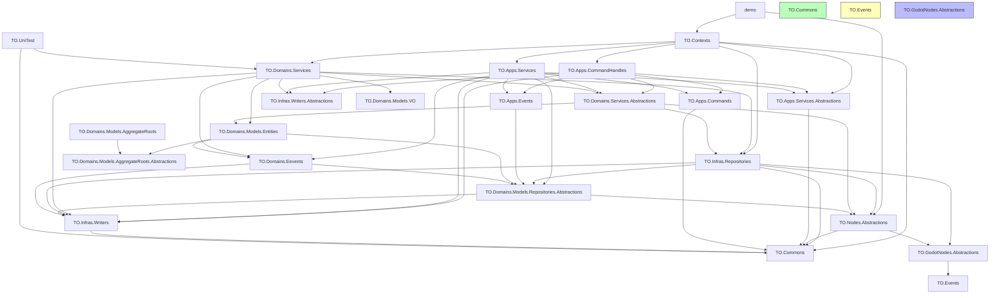

--- 


# 📚 Demo 项目依赖开发文档

## 🧩 一、项目概述

Demo 是一个基于 Godot 引擎（4.4.1）构建的游戏项目，采用模块化架构设计，使用 `.NET 9` 开发。项目中各子项目通过清晰的分层和引用关系实现松耦合，便于维护与扩展。

--- 


## 🏗️ 二、项目结构概览

项目名称 | SDK 类型 | 目标框架 | 作用
:----------- | :----------- | :----------- | :-----------
[demo.csproj](file://d:\GodotProjects\demo\demo.csproj) | `Godot.NET.Sdk/4.4.1` | `net9.0` | 主游戏项目，负责整合所有模块
[TO.Contexts.csproj](file://d:\GodotProjects\demo\TO.Contexts\TO.Contexts.csproj) | `Godot.NET.Sdk/4.4.1` | `net9.0` | 上下文管理核心模块，协调多个服务之间的交互
[TO.Apps.CommandHandles.csproj](file://d:\GodotProjects\demo\TO.Apps.CommandHandles\TO.Apps.CommandHandles.csproj) | `Microsoft.NET.Sdk` | `net9.0` | 应用层命令处理器实现
[TO.Apps.Commands.csproj](file://d:\GodotProjects\demo\TO.Apps.Commands\TO.Apps.Commands.csproj) | `Microsoft.NET.Sdk` | `net9.0` | 应用层命令定义
[TO.Apps.Services.csproj](file://d:\GodotProjects\demo\TO.Apps.Services\TO.Apps.Services.csproj) | `Microsoft.NET.Sdk` | `net9.0` | 应用服务实现模块
[TO.Apps.Services.Abstractions.csproj](file://d:\GodotProjects\demo\TO.Apps.Services.Abstractions\TO.Apps.Services.Abstractions.csproj) | `Microsoft.NET.Sdk` | `net9.0` | 应用服务接口定义
[TO.Apps.Events.csproj](file://d:\GodotProjects\demo\TO.Apps.Events\TO.Apps.Events.csproj) | `Microsoft.NET.Sdk` | `net9.0` | 应用层事件系统
[TO.Domains.Services.csproj](file://d:\GodotProjects\demo\TO.Domains.Services\TO.Domains.Services.csproj) | `Godot.NET.Sdk/4.4.1` | `net9.0` | 领域服务实现模块
[TO.Domains.Services.Abstractions.csproj](file://d:\GodotProjects\demo\TO.Domains.Services.Abstractions\TO.Domains.Services.Abstractions.csproj) | `Microsoft.NET.Sdk` | `net9.0` | 领域服务接口定义
[TO.Domains.Models.Entities.csproj](file://d:\GodotProjects\demo\TO.Domains.Models.Entities\TO.Domains.Models.Entities.csproj) | `Microsoft.NET.Sdk` | `net9.0` | 领域实体模型
[TO.Domains.Models.VO.csproj](file://d:\GodotProjects\demo\TO.Domains.Models.VO\TO.Domains.Models.VO.csproj) | `Microsoft.NET.Sdk` | `net9.0` | 领域值对象模型
[TO.Domains.Models.AggregateRoots.csproj](file://d:\GodotProjects\demo\TO.Domains.Models.AggregateRoots\TO.Domains.Models.AggregateRoots.csproj) | `Microsoft.NET.Sdk` | `net9.0` | 领域聚合根模型
[TO.Domains.Models.Repositories.Abstractions.csproj](file://d:\GodotProjects\demo\TO.Domains.Models.Repositories.Abstractions\TO.Domains.Models.Repositories.Abstractions.csproj) | `Microsoft.NET.Sdk` | `net9.0` | 领域仓储接口定义
[TO.Domains.Eevents.csproj](file://d:\GodotProjects\demo\TO.Domains.Eevents\TO.Domains.Eevents.csproj) | `Microsoft.NET.Sdk` | `net9.0` | 领域事件系统
[TO.Infras.Repositories.csproj](file://d:\GodotProjects\demo\TO.Infras.Repositories\TO.Infras.Repositories.csproj) | `Godot.NET.Sdk/4.4.1` | `net9.0` | 基础设施仓储实现模块
[TO.Infras.Writers.csproj](file://d:\GodotProjects\demo\TO.Infras.Writers\TO.Infras.Writers.csproj) | `Microsoft.NET.Sdk` | `net9.0` | 基础设施写入器实现模块
[TO.Infras.Writers.Abstractions.csproj](file://d:\GodotProjects\demo\TO.Infras.Writers.Abstractions\TO.Infras.Writers.Abstractions.csproj) | `Microsoft.NET.Sdk` | `net9.0` | 基础设施写入器接口定义
[TO.Nodes.Abstractions.csproj](file://d:\GodotProjects\demo\TO.Nodes.Abstractions\TO.Nodes.Abstractions.csproj) | `Microsoft.NET.Sdk` | `net9.0` | 节点系统抽象定义
[TO.GodotNodes.Abstractions.csproj](file://d:\GodotProjects\demo\TO.GodotNodes.Abstractions\TO.GodotNodes.Abstractions.csproj) | `Microsoft.NET.Sdk` | `net9.0` | Godot 节点抽象接口定义
[TO.Events.csproj](file://d:\GodotProjects\demo\TO.Events\TO.Events.csproj) | `Microsoft.NET.Sdk` | `net9.0` | 游戏事件发布订阅系统
[TO.Commons.csproj](file://d:\GodotProjects\demo\TO.Commons\TO.Commons.csproj) | `Godot.NET.Sdk/4.4.1` | `net9.0` | 公共工具类、共享模型、基础类型
[TO.UniTest.csproj](file://d:\GodotProjects\demo\TO.UniTest\TO.UniTest.csproj) | `Microsoft.NET.Sdk` | `net8.0` | 单元测试项目


--- 


## 🔗 三、依赖关系图（仅保留项目间引用）




--- 


## 📦 四、项目层级划分与职责说明

### 1. 最底层通用项目（Infrastructure Layer）

#### ✅ `TO.Commons`


- **职责**：存放通用工具类、基础模型、常量、扩展方法等。
- **被依赖情况**：几乎所有项目都依赖于它。
- **依赖**：仅依赖 Newtonsoft.Json 包。

#### ✅ `TO.Events`


- **职责**：提供全局事件发布订阅机制，用于跨模块通信。
- **依赖**：Autofac、GodotSharp 包。

#### ✅ `TO.GodotNodes.Abstractions`


- **职责**：定义 Godot 节点相关的抽象接口，供其他模块调用。
- **依赖**：

    - `TO.Events`
    - Autofac、GodotSharp 包

--- 


### 2. 抽象接口层（Abstractions Layer）

#### ✅ `TO.Apps.Services.Abstractions`


- **职责**：定义应用服务接口，供具体实现项目引用。
- **依赖**：`TO.Commons`

#### ✅ `TO.Domains.Services.Abstractions`


- **职责**：定义领域服务接口，供具体实现项目引用。
- **依赖**：

    - `TO.Domains.Models.Entities`
    - `TO.Infras.Repositories`
    - `TO.Nodes.Abstractions`
    - GodotSharp 包

#### ✅ `TO.Infras.Writers.Abstractions`


- **职责**：定义基础设施写入器接口，供具体实现项目引用。
- **依赖**：GDTask 包

#### ✅ `TO.Domains.Models.Repositories.Abstractions`


- **职责**：定义领域仓储接口，供具体实现项目引用。
- **依赖**：

    - `TO.Infras.Writers`
    - `TO.Nodes.Abstractions`
    - GDTask、GodotSharp 包

#### ✅ `TO.Nodes.Abstractions`


- **职责**：定义节点系统的抽象接口。
- **依赖**：

    - `TO.Commons`
    - `TO.GodotNodes.Abstractions`
    - Autofac、GodotSharp、R3 包

--- 


### 3. 领域模型层（Domain Model Layer）

#### ✅ `TO.Domains.Models.VO`


- **职责**：定义领域值对象模型。
- **依赖**：GodotSharp 包

#### ✅ `TO.Domains.Models.AggregateRoots.Abstractions`


- **职责**：定义领域聚合根抽象接口。
- **依赖**：无外部依赖

#### ✅ `TO.Domains.Models.AggregateRoots`


- **职责**：实现领域聚合根模型。
- **依赖**：`TO.Domains.Models.AggregateRoots.Abstractions`

#### ✅ `TO.Domains.Models.Entities`


- **职责**：定义领域实体模型。
- **依赖**：

    - `TO.Domains.Eevents`
    - `TO.Domains.Models.AggregateRoots.Abstractions`
    - `TO.Domains.Models.Repositories.Abstractions`

#### ✅ `TO.Domains.Eevents`


- **职责**：定义领域事件系统。
- **依赖**：

    - `TO.Domains.Models.Repositories.Abstractions`
    - `TO.Infras.Writers`

--- 


### 4. 应用层（Application Layer）

#### ✅ `TO.Apps.Commands`


- **职责**：定义应用层命令。
- **依赖**：

    - `TO.Commons`
    - MediatR.Contracts 包

#### ✅ `TO.Apps.Events`


- **职责**：定义应用层事件。
- **依赖**：`TO.Domains.Models.Repositories.Abstractions`

#### ✅ `TO.Apps.Services`


- **职责**：实现应用服务逻辑。
- **依赖**：

    - `TO.Apps.Commands`
    - `TO.Apps.Events`
    - `TO.Apps.Services.Abstractions`
    - `TO.Domains.Eevents`
    - `TO.Domains.Models.Repositories.Abstractions`
    - `TO.Domains.Services.Abstractions`
    - `TO.Infras.Writers.Abstractions`
    - `TO.Infras.Writers`
    - MediatR 包

#### ✅ `TO.Apps.CommandHandles`


- **职责**：实现应用层命令处理器。
- **依赖**：

    - `TO.Apps.Commands`
    - `TO.Apps.Events`
    - `TO.Apps.Services.Abstractions`
    - `TO.Domains.Services.Abstractions`
    - `TO.Infras.Writers.Abstractions`
    - `TO.Infras.Writers`
    - MediatR 包

--- 


### 5. 实现层（Implementation Layer）

#### ✅ `TO.Domains.Services`


- **职责**：实现领域服务逻辑。
- **依赖**：

    - `TO.Domains.Eevents`
    - `TO.Domains.Models.Entities`
    - `TO.Domains.Models.VO`
    - `TO.Domains.Services.Abstractions`
    - `TO.Infras.Repositories`
    - `TO.Infras.Writers.Abstractions`
    - `TO.Infras.Writers`

#### ✅ `TO.Infras.Writers`


- **职责**：基础设施数据写入实现（如文件、配置等）。
- **依赖**：

    - `TO.Commons`
    - CsvHelper、Newtonsoft.Json 包

#### ✅ `TO.Infras.Repositories`


- **职责**：基础设施仓储实现（如数据访问、持久化等）。
- **依赖**：

    - `TO.Commons`
    - `TO.Domains.Models.Repositories.Abstractions`
    - `TO.GodotNodes.Abstractions`
    - `TO.Infras.Writers`
    - `TO.Nodes.Abstractions`
    - GDTask、R3 包

#### ✅ `TO.Contexts`


- **职责**：上下文管理核心模块，协调多个服务之间的交互。
- **依赖**：

    - `TO.Apps.CommandHandles`
    - `TO.Apps.Services.Abstractions`
    - `TO.Apps.Services`
    - `TO.Commons`
    - `TO.Domains.Services`
    - `TO.Infras.Repositories`
    - Autofac、MediatR、MediatR.Extensions.Autofac.DependencyInjection 包

--- 


### 6. 主入口项目（Game Layer）

#### ✅ `demo`


- **职责**：主游戏入口，动态加载模块并启动游戏。
- **依赖**：

    - `TO.Contexts`
    - `TO.Nodes.Abstractions`
    - Autofac 包

--- 


## 🧪 七、单元测试项目

#### ✅ `TO.UniTest`


- **职责**：提供对关键业务逻辑的单元测试。
- **目标框架**：`net8.0`（注意：与其他项目的 net9.0 不同）
- **依赖**：

    - `TO.Commons`
    - `TO.Domains.Services`
    - Autofac 包

--- 


## 📝 八、开发建议

### 1. 分层开发原则


- 所有项目应遵循"上层依赖下层"的原则，确保依赖方向统一向下。
- 修改通用项目时需谨慎，影响范围较大。
- 抽象层项目应保持稳定，避免频繁修改接口。

### 2. 模块化开发


- 各功能模块可独立开发、测试、部署。
- 可通过 `TO.Contexts` 进行集中注册和管理。
- 使用依赖注入容器（Autofac）管理对象生命周期。

### 3. 推荐开发顺序


1. **基础层**：`TO.Commons` → `TO.Events` → `TO.GodotNodes.Abstractions`
2. **抽象层**：`TO.Nodes.Abstractions` → `TO.Infras.Writers.Abstractions` → `TO.Apps.Services.Abstractions`
3. **领域模型层**：`TO.Domains.Models.VO` → `TO.Domains.Models.AggregateRoots.Abstractions` → `TO.Domains.Models.AggregateRoots`
4. **领域层**：`TO.Domains.Models.Repositories.Abstractions` → `TO.Domains.Eevents` → `TO.Domains.Models.Entities`
5. **基础设施层**：`TO.Infras.Writers` → `TO.Infras.Repositories`
6. **应用层**：`TO.Apps.Commands` → `TO.Apps.Events` → `TO.Domains.Services.Abstractions` → `TO.Domains.Services`
7. **服务层**：`TO.Apps.Services` → `TO.Apps.CommandHandles`
8. **集成层**：`TO.Contexts`
9. **主项目**：`demo`
10. **测试项目**：`TO.UniTest`

### 4. 技术栈说明


- **框架版本**：.NET 9.0（除测试项目使用 .NET 8.0）
- **游戏引擎**：Godot 4.4.1
- **依赖注入**：Autofac 8.3.0
- **中介者模式**：MediatR 12.5.0
- **异步任务**：GDTask 1.4.1
- **响应式编程**：R3 1.3.0
- **序列化**：Newtonsoft.Json 13.0.3
- **CSV处理**：CsvHelper 33.1.0

--- 


## 📁 九、目录结构建议（参考）


```
demo/
├── TO.Commons/                                    # 通用库
├── TO.Events/                                     # 全局事件系统
├── TO.GodotNodes.Abstractions/                    # Godot 节点抽象
├── TO.Nodes.Abstractions/                         # 节点系统抽象
├── TO.Apps.Services.Abstractions/                 # 应用服务接口
├── TO.Domains.Services.Abstractions/              # 领域服务接口
├── TO.Infras.Writers.Abstractions/                # 基础设施写入器接口
├── TO.Domains.Models.Repositories.Abstractions/   # 领域仓储接口
├── TO.Domains.Models.VO/                          # 领域值对象
├── TO.Domains.Models.AggregateRoots.Abstractions/ # 领域聚合根抽象
├── TO.Domains.Models.AggregateRoots/               # 领域聚合根实现
├── TO.Domains.Eevents/                            # 领域事件
├── TO.Domains.Models.Entities/                    # 领域实体
├── TO.Infras.Writers/                             # 基础设施写入器实现
├── TO.Infras.Repositories/                        # 基础设施仓储实现
├── TO.Apps.Commands/                              # 应用层命令
├── TO.Apps.Events/                                # 应用层事件
├── TO.Domains.Services/                           # 领域服务实现
├── TO.Apps.Services/                              # 应用服务实现
├── TO.Apps.CommandHandles/                        # 命令处理器
├── TO.Contexts/                                   # 上下文管理
├── demo/                                          # 主游戏项目
└── TO.UniTest/                                    # 单元测试


```

--- 


## 📋 十、总结

本文档详细描述了 Demo 项目的依赖关系和架构设计。项目采用了清晰的分层架构，通过依赖注入和中介者模式实现了松耦合的设计。各个模块职责明确，便于维护和扩展。

在开发过程中，建议严格按照依赖方向进行开发，确保架构的稳定性和可维护性。
