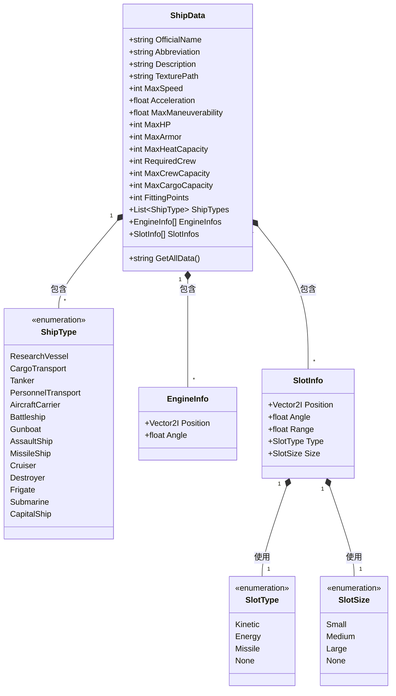

# 飞船数据类文档 (ShipData Class Documentation)

## 类结构说明 (Class Structure Explanation)

### ShipData 类 (飞船数据)
```csharp
public class ShipData
{
    // 飞船基本属性 (Basic Ship Properties)
    public string OfficialName;       // 飞船官方名称 (Official ship name)
    public string Abbreviation;      // 飞船简称 (Ship abbreviation)
    public string Description;       // 飞船描述 (Ship description)
    public string TexturePath;       // 贴图地址 (Texture file path)
    public int MaxSpeed;             // 最大航速 (Maximum speed)
    public float Acceleration;       // 加速度 (Acceleration rate)
    public float MaxManeuverability; // 最大机动性 (Maximum maneuverability)
    
    // 飞船能力属性 (Ship Capability Properties)
    public int MaxHP;                // 最大血量 (Maximum hit points)
    public int MaxArmor;             // 最大护甲 (Maximum armor value)
    public int MaxHeatCapacity;      // 最大热能容量 (Maximum heat capacity)
    public int RequiredCrew;         // 所需人员 (Required crew size)
    public int MaxCrewCapacity;      // 最大载员 (Maximum crew capacity)
    public int MaxCargoCapacity;     // 最大载货 (Maximum cargo capacity)
    public int FittingPoints;        // 装配点 (Fitting points)
    
    // 飞船类型枚举 (Ship Type Enumeration)
    public List<ShipType> ShipTypes; // 飞船类型列表 (List of ship types)
    public enum ShipType
    {
        ResearchVessel,      // 科考船 (Scientific research vessel)
        CargoTransport,      // 货物运输舰 (Cargo transport ship)
        Tanker,              // 油轮 (Fuel tanker)
        PersonnelTransport,  // 人员运输舰 (Personnel transport)
        AircraftCarrier,     // 航母 (Aircraft carrier)
        Battleship,          // 战列舰 (Battleship)
        Gunboat,             // 炮艇 (Gunboat)
        AssaultShip,         // 突击舰 (Assault ship)
        MissileShip,         // 导弹舰 (Missile ship)
        Cruiser,             // 巡洋舰 (Cruiser)
        Destroyer,           // 驱逐舰 (Destroyer)
        Frigate,             // 护卫舰 (Frigate)
        Submarine,           // 潜艇 (Submarine)
        CapitalShip          // 主力舰 (Capital ship)
    }
    
    // 引擎信息类 (Engine Information Class)
    public EngineInfo[] EngineInfos; // 引擎信息列表 (List of engine information)
    public class EngineInfo
    {
        public Vector2I Position; // 引擎位置 (Engine position)
        public float Angle;       // 引擎角度 (Engine angle)
    }
    
    // 槽位信息类 (Slot Information Class)
    public SlotInfo[] SlotInfos; // 槽位信息列表 (List of slot information)
    public class SlotInfo
    {
        public Vector2I Position; // 槽位位置 (Slot position)
        public float Angle;       // 槽位角度 (Slot angle)
        public float Range;       // 槽位范围 (Slot range)
        
        // 槽位类型枚举 (Slot Type Enumeration)
        public SlotType Type = SlotType.None; // 槽位类型 (Slot type)
        public enum SlotType
        {
            Kinetic, // 动能 (Kinetic)
            Energy,  // 能量 (Energy)
            Missile, // 导弹 (Missile)
            None    // 无 (None)
        }
        
        // 槽位大小枚举 (Slot Size Enumeration)
        public SlotSize Size = SlotSize.None; // 槽位大小 (Slot size)
        public enum SlotSize
        {
            Small,  // 小 (Small)
            Medium, // 中 (Medium)
            Large,  // 大 (Large)
            None   // 无 (None)
        }
    }
    
    // 获取所有数据方法 (Get All Data Method)
    public string GetAllData()
    {
        string allData = "";
        allData += "OfficialName: " + OfficialName + "\n";
        allData += "Abbreviation: " + Abbreviation + "\n";
        allData += "TexturePath: " + TexturePath + "\n";
        allData += "MaxSpeed: " + MaxSpeed + "\n";
        allData += "Acceleration: " + Acceleration + "\n";
        allData += "MaxManeuverability: " + MaxManeuverability + "\n";
        allData += "MaxHP: " + MaxHP + "\n";
        allData += "MaxArmor: " + MaxArmor + "\n";
        allData += "MaxHeatCapacity: " + MaxHeatCapacity + "\n";
        allData += "RequiredCrew: " + RequiredCrew + "\n";
        allData += "MaxCrewCapacity: " + MaxCrewCapacity + "\n";
        allData += "MaxCargoCapacity: " + MaxCargoCapacity + "\n";
        allData += "FittingPoints: " + FittingPoints + "\n";
        
        foreach (ShipType type in ShipTypes)
        {
            allData += "ShipType: " + type.ToString() + "\n";
        }
        
        return allData;
    }
}
```

## 使用示例 (Usage Example)

### 创建飞船数据对象 (Creating a ShipData Object)
```csharp
ShipData battleship = new ShipData
{
    OfficialName = "银河级战列舰",
    Abbreviation = "银河",
    Description = "主力战舰，配备重型武器和强大护盾",
    TexturePath = "res://ships/galaxy_class.png",
    MaxSpeed = 120,
    Acceleration = 8.5f,
    MaxManeuverability = 0.75f,
    MaxHP = 5000,
    MaxArmor = 800,
    MaxHeatCapacity = 3000,
    RequiredCrew = 200,
    MaxCrewCapacity = 350,
    MaxCargoCapacity = 500,
    FittingPoints = 60,
    ShipTypes = new List<ShipData.ShipType> 
    { 
        ShipData.ShipType.Battleship, 
        ShipData.ShipType.CapitalShip 
    },
    
    // 添加引擎信息 (Adding engine information)
    EngineInfos = new ShipData.EngineInfo[]
    {
        new ShipData.EngineInfo { Position = new Vector2I(0, -50), Angle = 180f },
        new ShipData.EngineInfo { Position = new Vector2I(20, -50), Angle = 180f },
        new ShipData.EngineInfo { Position = new Vector2I(-20, -50), Angle = 180f }
    },
    
    // 添加武器槽位 (Adding weapon slots)
    SlotInfos = new ShipData.SlotInfo[]
    {
        new ShipData.SlotInfo 
        { 
            Position = new Vector2I(0, 30), 
            Angle = 0f, 
            Range = 1000f,
            Type = ShipData.SlotInfo.SlotType.Kinetic,
            Size = ShipData.SlotInfo.SlotSize.Large
        },
        new ShipData.SlotInfo 
        { 
            Position = new Vector2I(-40, 20), 
            Angle = -30f, 
            Range = 800f,
            Type = ShipData.SlotInfo.SlotType.Missile,
            Size = ShipData.SlotInfo.SlotSize.Medium
        },
        new ShipData.SlotInfo 
        { 
            Position = new Vector2I(40, 20), 
            Angle = 30f, 
            Range = 800f,
            Type = ShipData.SlotInfo.SlotType.Missile,
            Size = ShipData.SlotInfo.SlotSize.Medium
        }
    }
};

// 获取所有数据 (Get all data)
string shipInfo = battleship.GetAllData();
GD.Print(shipInfo);
```

### 输出示例 (Sample Output)
```
OfficialName: 银河级战列舰
Abbreviation: 银河
TexturePath: res://ships/galaxy_class.png
MaxSpeed: 120
Acceleration: 8.5
MaxManeuverability: 0.75
MaxHP: 5000
MaxArmor: 800
MaxHeatCapacity: 3000
RequiredCrew: 200
MaxCrewCapacity: 350
MaxCargoCapacity: 500
FittingPoints: 60
ShipType: Battleship
ShipType: CapitalShip
```

## 类关系图 (Class Relationship Diagram)



## 关键功能说明 (Key Functionality Explanation)

1. **基本属性 (Basic Properties)**
   - `OfficialName`：飞船的正式名称（如"银河级战列舰"）
   - `Abbreviation`：飞船的简称或代号（如"银河"）
   - `TexturePath`：飞船贴图资源的文件路径
   - 移动属性：`MaxSpeed`（最大速度）、`Acceleration`（加速度）、`MaxManeuverability`（最大机动性）

2. **能力属性 (Capability Properties)**
   - 生存能力：`MaxHP`（最大生命值）、`MaxArmor`（最大护甲值）
   - 能源系统：`MaxHeatCapacity`（最大热能容量）
   - 人员配置：`RequiredCrew`（最低所需人员）、`MaxCrewCapacity`（最大载员量）
   - 货运能力：`MaxCargoCapacity`（最大货物容量）
   - 装配系统：`FittingPoints`（可用于安装武器和模块的装配点数）

3. **飞船类型 (Ship Types)**
   - 使用`ShipType`枚举定义飞船的多种类型（如战列舰、航母等）
   - 一个飞船可以属于多个类型（如同时属于战列舰和主力舰）

4. **引擎系统 (Engine System)**
   - `EngineInfo`类定义每个引擎的位置和角度
   - 飞船可以有多个引擎，每个都有独立的位置和方向

5. **武器槽位系统 (Weapon Slot System)**
   - `SlotInfo`类定义每个武器槽位的属性
   - 槽位类型：`Kinetic`（动能武器）、`Energy`（能量武器）、`Missile`（导弹武器）
   - 槽位大小：`Small`（小型）、`Medium`（中型）、`Large`（大型）
   - 每个槽位有特定的位置、角度和射程范围

6. **数据获取方法 (Data Retrieval Method)**
   - `GetAllData()`方法返回包含所有属性的格式化字符串
   - 用于调试、显示或保存飞船的完整配置信息

这个类结构提供了完整的飞船数据表示，适用于游戏开发中的飞船配置、生成和显示系统。