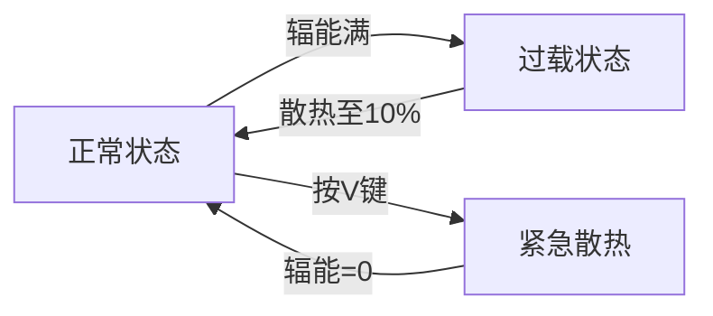
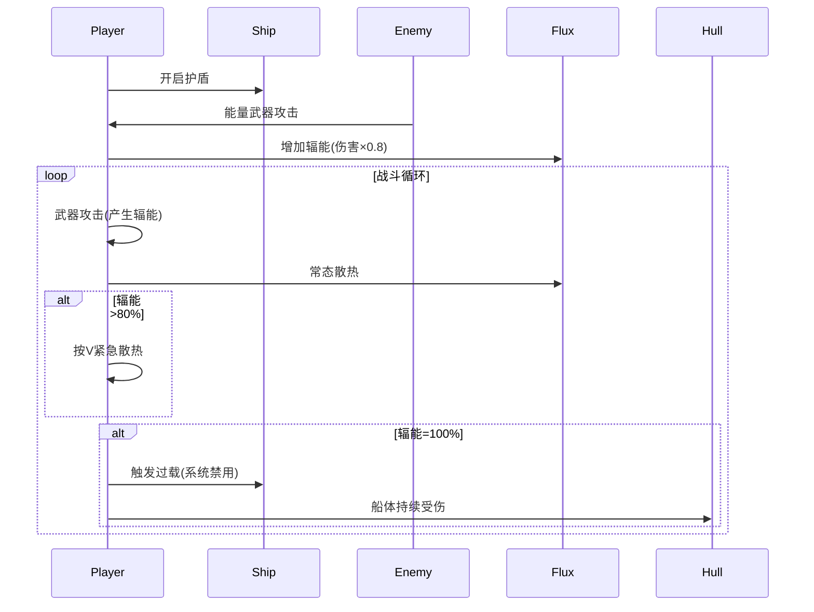

## 战斗系统设计：舰船战斗与辐能管理

注意！该文档出现的一切具体数值都是临时的

### 1. 战斗触发机制

- **主动追击**：玩家舰队可主动追击敌方舰队进入战斗
- **拦截惩罚**：当舰队移动速度低于敌方时，可能被敌方追上并强制进入战斗
- **遭遇战**：在星图中随机遭遇敌人进入战斗

### 2. 指挥点数系统 (Command Points, CP)

- **机制**：
  - 每艘舰船占用CP值，CP总值限制玩家可部署的舰队规模
  - 舰船CP需求 = 基础值 × 舰船等级系数
    - 小型护卫舰：CP=5
    - 中型巡洋舰：CP=15
    - 大型战列舰：CP=30
- **指挥官成长**：
  - 基础CP值：100
  - 可通过技能提升：
    - 高级指挥模块：+20 CP
    - 舰队协同协议：+10% CP效率

### 3. 舰船防御系统（三层结构）

| 防御层 | 特性 | 伤害减免 | 特殊机制 |
|--------|------|----------|----------|
| **护盾** | 能量屏障 | 免疫90%动能武器伤害 免疫能量武器伤害 | 1. 开启时持续产生辐能 2. 被击中时根据伤害增加辐能 3. 可主动关闭 |
| **装甲** | 物理防护层 | 90%全伤害减免 （特殊船体可能不同）| 1. 屏蔽90%辐射伤害 2. 对动能伤害有额外减伤 3. 被动能武器击中仍产生辐能 |
| **船体** | 结构生命值 | 无减免 | 1. 直接攻击船体不会增加辐能 2. 归零时舰船爆炸 |

### 4. 辐能（Flux）管理系统

#### 辐能产生来源

| 来源 | 辐能值 | 说明 |
|------|--------|------|
| 移动 | 0.5/秒 | 按移动方向键持续产生 |
| 攻击 | 武器差异 | 能量武器：高辐能 动能武器：中辐能 导弹：无辐能 |
| 护盾受击 | 伤害值×0.8 | 按实际伤害比例转换 |
| 特殊武器 | 效果附加 | “热能过载”等词条武器 |

#### 辐能消耗方式

| 方式 | 散热率 | 状态限制 |
|------|--------|----------|
| 常态散热 | 基础值 | 无限制（被动持续） |
| 紧急散热(V) | 5×基础值 | 不可移动/攻击/开盾 |
| 过载惩罚 | 强制散热 | 移动/武器/护盾系统禁用 |

#### 辐能状态机

#### 过载惩罚

- 所有系统禁用（移动/攻击/护盾）
- 船体每秒受到5%最大生命值的真实伤害
- 持续到辐能降至10%以下

### 5. 武器系统设计

| 武器类型 | 伤害效果 | 辐能产生 | 破防特性 |
|----------|----------|----------|----------|
| **动能武器** | 高冲击力 | 中 | 对护盾无效 对装甲有25%穿甲 |
| **能量武器** | 持续灼烧 | 高 | 100%被护盾吸收 对装甲有50%效率 |
| **辐射武器** | 系统破坏 | 低 | 穿透护盾 被装甲吸收90% |
| **导弹类** | 爆发伤害 | 无 | 无视护盾 直接攻击装甲/船体 |

### 6. 战术决策点

1. **护盾管理**：
   - 开盾时机：预判攻击时开启
   - 关盾策略：辐能过高时主动关闭承受伤害
2. **散热时机**：
   - 安全时：主动散热避免过载
   - 危险时：承受过载风险维持火力
3. **武器搭配**：
   - 破盾组合：辐射武器+导弹
   - 火力压制：高辐能能量武器连射

### 7. 舰船定制扩展

- **散热系统改装**：
  - 基础散热器：+20%散热率
  - 过载冷却装置：减少过载惩罚时间50%
- **护盾发生器**：
  - 偏转护盾：动能抗性+20%
  - 相位护盾：能量武器吸收效率+30%
- **装甲强化**：
  - 反应装甲：动能伤害减免额外+15%
  - 辐射镀层：辐射抗性+25%

### 8. 战斗流程示例

### 9. 平衡性设计

- **散热基准值**：
  - 小型船：50/秒
  - 中型船：30/秒
  - 大型船：15/秒
- **过载伤害**：
  - 小型船：3%/秒（更易过热但伤害低）
  - 大型船：7%/秒（散热慢但更致命）

### 10. 界面反馈要素

- 辐能进度条（分三级颜色）：
  - <60%：蓝色
  - 60-90%：黄色
  - >90%：红色
- 过载警告图标闪烁
- 散热状态特效（船体排气口喷发粒子）
