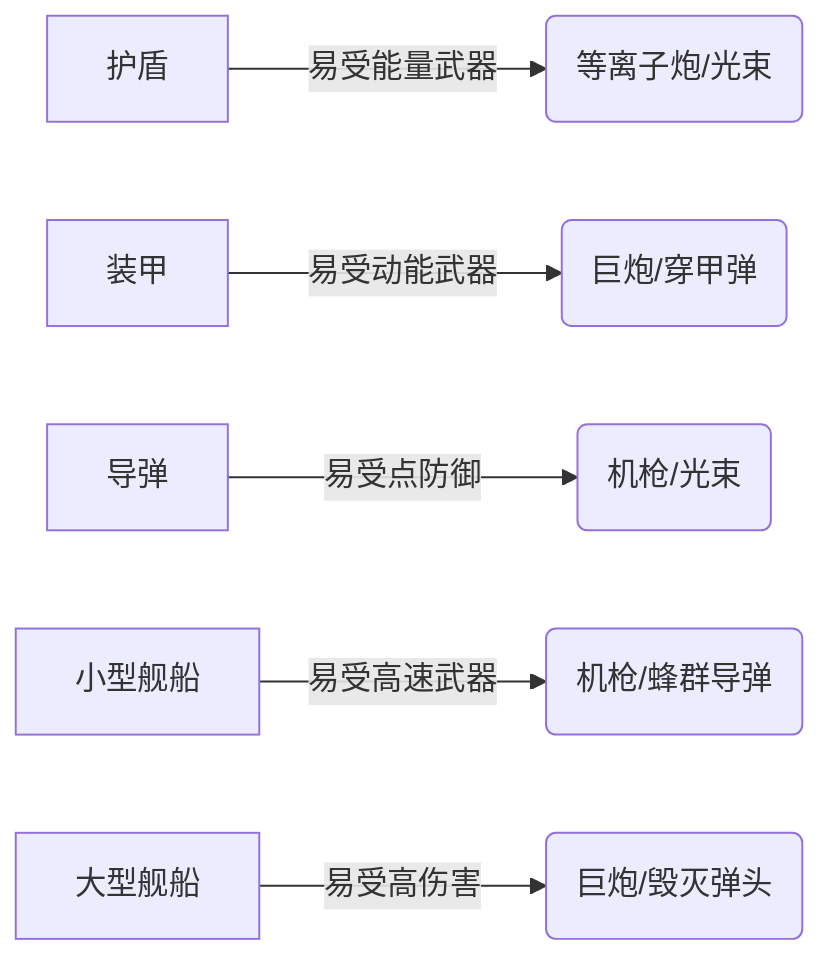

# 武器系统设计文档
## 1. 武器分类
### 1.1 动能武器 (Kinetic Weapons)
动能武器依靠物理投射物造成伤害，通常对装甲有较好的效果，但可能被护盾完全或部分阻挡。
#### (1) 实弹武器 (Projectile Weapons)
- **机枪类 (Gatling Guns)**
  - **特点**：高射速、低单发伤害、高DPS（每秒伤害）
  - **用途**：
    - 持续输出，快速削减敌方装甲
    - 拦截敌方导弹和无人机（点防御）
    - 骚扰敌方小型舰船，阻止其行动
  - **限制**：有效射程较短，远距离精度下降
  - **辐能产生**：中低（持续射击累积辐能）
  - **弹药类型**：通常使用金属弹丸，备弹量高
- **巨炮类 (Cannons)**
  - **特点**：低射速、高单发伤害、长射程
  - **用途**：
    - 对敌方装甲造成重创（对装甲特攻）
    - 狙击敌方关键部位（如武器系统、引擎）
    - 远程火力压制
  - **限制**：装填时间长，机动性差的目标易命中
  - **辐能产生**：高（每次射击产生大量辐能）
  - **弹药类型**：高爆弹、穿甲弹、电磁弹等
#### (2) 导弹类 (Missiles)
导弹是自主制导武器，发射后自动追踪目标，但可能被拦截。
- **蜂群导弹 (Swarm Missiles)**
  - **特点**：高速、数量多、单发伤害低、高发射频率
  - **用途**：
    - 饱和攻击，突破敌方点防御系统
    - 骚扰和压制敌方，迫使其消耗拦截资源
    - 对无防护的小型目标高效
  - **限制**：易被点防御武器拦截，单发伤害低
  - **辐能产生**：低（发射时产生，导弹飞行中不产生）
  - **制导方式**：红外/雷达复合制导，抗干扰能力中等
- **毁灭弹头 (Devastator Warheads)**
  - **特点**：低速、单发伤害极高、携带量少
  - **用途**：
    - 对大型目标（如战列舰、空间站）造成毁灭性打击
    - 作为决战兵器，一击改变战局
  - **限制**：易被拦截，发射后需要较长时间命中
  - **辐能产生**：高（发射时产生高额辐能）
  - **制导方式**：重型导弹，可能采用惯性导航+末端制导，抗干扰强
### 1.2 能量武器 (Energy Weapons)
能量武器直接发射高能粒子或光束，通常对护盾有较好效果，部分武器可穿透或绕过护盾。
#### (1) 等离子炮 (Plasma Cannons)
- **特点**：发射高温等离子体团，中等射速，范围伤害（AOE）
- **用途**：
  - 对舰船集群造成范围伤害
  - 对护盾和装甲均有不错效果（均衡型）
  - 攻击大型慢速目标时效率高
- **限制**：弹道速度较慢，远距离难以命中高速目标
- **辐能产生**：高（每次射击产生高辐能）
- **特殊机制**：等离子团在飞行一定时间后可能扩散，伤害范围扩大但单点伤害降低
#### (2) 光束武器 (Beam Weapons)
- **特点**：持续能量光束，瞬间命中，可精确聚焦
- **用途**：
  - 持续灼烧目标，高DPS
  - 精确打击子系统（如武器、引擎）
  - 反导防御（点防御模式）
- **限制**：持续照射产生高额辐能，需要稳定瞄准
- **辐能产生**：非常高（持续照射时按秒产生高辐能）
- **类型细分**：
  - **脉冲光束**：短时高能脉冲，适合爆发
  - **持续光束**：长时间照射，适合持续输出
## 2. 武器系统特性扩展
### 2.1 通用特性
- **装填/冷却机制**：
  - 实弹武器：需要装填时间，装填期间无法射击
  - 能量武器：需要冷却，过热则强制停用
- **弹药管理**（仅实弹和导弹）：
  - 弹药有限，需在空间站补充
  - 可升级增加备弹量或使用通用弹药
### 2.2 特殊效果
- **穿甲能力**：巨炮和毁灭弹头对装甲有额外伤害
- **护盾穿透**：部分能量武器可部分穿透护盾（如等离子炮）
- **子系统破坏**：光束武器有概率导致目标子系统失效
- **EMP效果**：特殊导弹或能量武器可造成电磁脉冲，暂时瘫痪目标
### 2.3 武器升级
- **伤害提升**：增加基础伤害
- **射速提升**：提高射击频率
- **射程提升**：增加有效射程
- **特殊改装**：
  - 制导强化（导弹）：提高导弹追踪能力和抗干扰
  - 点防御系统（机枪/光束）：提升拦截效率
  - 散热优化（能量武器）：降低辐能产生
## 3. 战术搭配建议
### 3.1 舰船武器配置示例
| 舰船类型   | 推荐武器配置                        | 战术定位               |
|------------|-------------------------------------|------------------------|
| **护卫舰** | 机枪×2 + 蜂群导弹×1                 | 点防御，骚扰，反小型目标 |
| **巡洋舰** | 巨炮×1 + 等离子炮×2 + 点防御光束×1  | 火力输出，反中型目标    |
| **战列舰** | 巨炮×2 + 毁灭弹头×1 + 光束炮×2      | 主力输出，决战兵器      |
### 3.2 对抗策略
- **对抗护盾**：优先使用能量武器（等离子炮、光束）或破盾导弹
- **对抗装甲**：使用动能武器（巨炮、穿甲弹）或毁灭弹头
- **拦截导弹**：使用机枪或光束点防御系统
- **高机动目标**：使用光束或高速导弹（蜂群）
## 4. 平衡性设计
### 4.1 武器性能对照表
| 武器类型       | DPS  | 射程 | 射速 | 单发伤害 | 辐能/秒 | 弹药消耗 |
|----------------|------|------|------|----------|---------|----------|
| 机枪           | 高   | 短   | 极高 | 低       | 中      | 高       |
| 巨炮           | 中   | 长   | 低   | 极高     | 高      | 低       |
| 蜂群导弹       | 中   | 中   | 中   | 低       | 低      | 中       |
| 毁灭弹头       | 低   | 长   | 极低 | 超高     | 高      | 低       |
| 等离子炮       | 中高 | 中   | 中   | 中高     | 高      | 无       |
| 光束武器       | 超高 | 中短 | 持续| 持续伤害 | 超高    | 无       |
### 4.2 武器克制关系

## 5. 扩展设计：武器定制系统
### 5.1 模块化武器组件
- **枪管/发射器**：影响射程和精度
- **弹药类型**（实弹/导弹）：
  - **穿甲弹**：增加对装甲伤害
  - **高爆弹**：范围伤害，对护盾效果差
  - **EMP弹**：造成系统瘫痪
- **能量核心**（能量武器）：影响伤害和射速
- **制导系统**（导弹）：提高追踪能力和抗干扰
### 5.2 实验性武器
- **磁轨炮**：混合动能/能量，高速高穿甲
- **引力鱼雷**：造成区域引力扭曲，控制敌人
- **反物质弹**：超高伤害，但极危险（可能自伤）